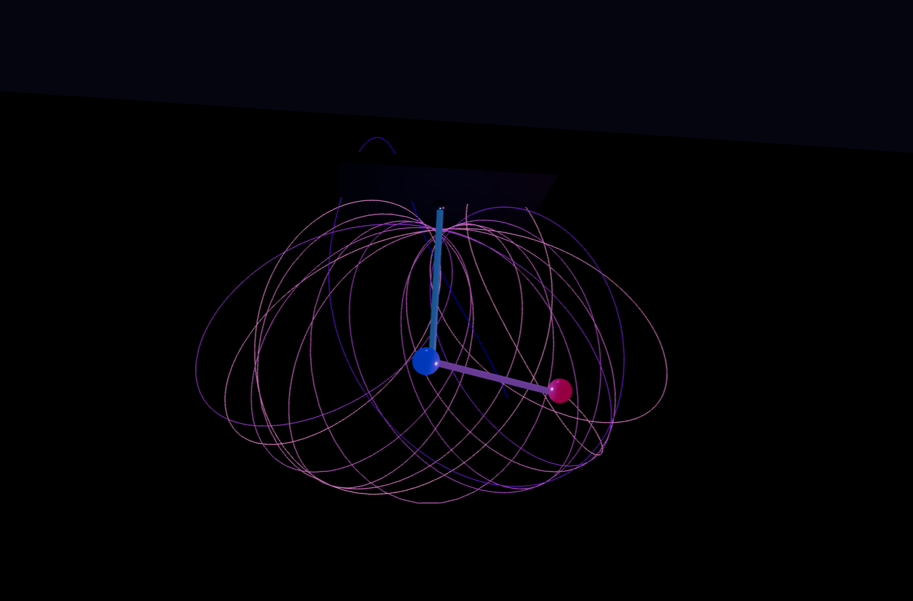

# kineticStrands

Simulation of a system of coupled non-linear second-order differential equations using Lagrangian mechanics.



---

## Derivation

The derivation of the system of differential equations can be found here:  
[View Derivation](https://example.com)

---

## Build Environment

The project was developed and tested with the following environment:

- Python 3.14.3  
- Node.js v24.14.1 (LTS)  
- npm 11.11.0  
- Windows 11  

---

## Dependencies

### Backend


### Frontend


---

## Setup Instructions

### 1. Clone the repository
```bash
git clone https://github.com/codechiefVignesh/kineticStrands.git
cd kineticStrands
```

---

### 2. Backend Setup
```bash
cd backend
python -m venv venv
venv\Scripts\activate
pip install fastapi uvicorn numpy scipy
```

---

### 3. Frontend Setup
```bash
cd ../frontend
npm create vite@latest . -- --template react
npm install
npm install three @react-three/fiber @react-three/drei axios
```

---

### 4. Run Backend
```bash
cd ../backend
uvicorn main:app --reload
```

---

### 5. Configure Frontend

Copy the contents of the following directory:

```
kineticStrands/crack/
```

into your frontend project:
- App.jsx  
- App.css  
- index.html  

---

### 6. Run Frontend
```bash
cd ../frontend
npm run dev
```

---

### 7. Access the Application

Open the following URL in your browser:

```
http://localhost:5173
```

---

## Notes

- Ensure the backend server is running before starting the frontend  
- The simulation is sensitive to initial conditions due to its chaotic nature  
- Backend uses FastAPI for numerical computation and API handling  
- Frontend uses React and Three.js for visualization  
